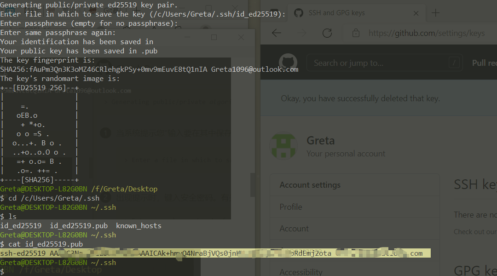

Git  从安装到使用

**Git**是一个开源的分布式版本控制系统，可以有效、高速地处理从很小到非常大的项目版本管理。 Git 是 Linus Torvalds 为了帮助管理 Linux 内核开发而开发的一个开放源码的版本控制软件。

**Git bash**是Windows下的一款命令行工具。基于msys GNU环境，主要用于git。

**GitHub** 是基于 Git 的一个代码托管网站。开发者可以将代码在 GitHub 上开源，可以浏览其它项目的代码，fork 到自己名下做修改，clone 回本地（没有访问权限的 private repo 除外）使用，也可以发起 pull request 向上游提交自己的修改。


单词与命令
| 英文             | 命令缩写 | 汉语     | 英文  | 命令缩写 | 汉语 |
| ---------------- | -------- | -------- | ----- | -------- | ---- |
| make             | mk       | 制作     | list  | ls       | 列表 |
| move             | mv       | 移动     | link  | ln       | 链接 |
| remove           | rm       | 删除     | find  | find     | 找到 |
| copy             | cp       | 拷贝     | echo  | echo     | 回声 |
| change directory | cd       | 改变目录 | touch | touch    | 触摸 |
| recursive        |          | 递归     | force | -f       | 强制 |


# 一、常用命令

## 查

```bash
# 输出当前工作目录的绝对路径
$ pwd    #print working directory 

# 查看当前目录内容
$ ls     #list
$ ls 路径  # 查看指定目录内容
#注意：ls默认不显示以‘.’开头的文件

# 查看文件内容
$ cat 文件路径   #显示所有内容
$ hesd 文件路径  #显示前十行代码
$ tail 文件路径   #显示后十行代码
	# 注意：‘head’和‘tail’可通过‘-n’控制具体显示几行 示例如下：
	$ head style.css -n 14  #显示前14行代码
$ less 路径  #分页可滚动查看  上下键或J、K键 可使用Q键退出，但是当某部分高亮时，需Esc退出高亮，再Q键退出
```


## 增：创建

**注意确定工作目录**

```bash
# 创建空文件
$ touch 1.txt

# 创建有内容文件
$ echo 内容 > 1.txt           # '>'添加内容到文件中，会把文件中原有的内容覆盖掉
$ echo 内容 >> 1.txt          # '>>'追加内容到文件中
$ echo -e "nihao\nhello" >> 1.txt    #追加多行内容加-e参数双引号使转义生效

# 创建目录  
$ mkdir a                 # 创建目录(文件夹)a/  
$ mkdir -p a/b/c/d/e      # 创建多层目录a/b/c/d/e
$ mkdir a b               # 创建多个目录
$ mkdir -p a/b/c a/d/e f/g    # 创建多个目录

# 创建多个文件
$ touch index.html style.css

# 复制
$ cp 1.txt 2.txt        #复制1.txt的内容到2.txt
$ cp -r a b             #复制目录，将a文件夹中的所有内容复制到b文件夹
```


## 删

```bash 
# 删除文件
$ rm 1.txt

# 删除目录
$ rm -r a  # 强制删除使用-rf(不要轻易尝试)
```

> 所有功能、配置、系统等本质都是文件，使用‘-rf’强制删除后可能导致系统出错


## 改

```bash
# 追加文件内容
$ echo

# 修改文件内容（打开文件）
$ code 1.txt     #用code打开
$ start 1.txt    #用默认打开方式打开
$ vi 1.txt       #用vim打开    :+q+enter退出vim

# 清空文件内容（不是删除文件
$ echo '' > 1.txt    #使用空内容覆盖

# 移动/重命名文件或目录
$ mv 1.txt a       #把1.txt文件移动到a目录下
$ mv a/1.txt .     #把a目录下的1.txt文件移到当前目录下
$ mv 1.txt 2.txt   #重命名

# 修改文件的更新时间
$ ls -l            #查看文件详细信息
$ touch 1.txt      #修改文件的更新时间
```


## 命令组合

- `echo $?`查看上一条命令的返回值
- `&&`   连接多条命令，上一条命令成功后执行下一条命令
- `;`    连接多条命令，上一条命令不管成功与否都执行下一条命令


> **练习：**用命令写代码

```bash
$ touch jb              #创建一个文件jb
$ chmod +x jb           #添加可执行权限
$ code jiaoben          #用code打开jiaoben文件
$ mkdir x;              #创建一个目录x
$ cd x;                 #进入这个目录
$ touch index.html;        #创建文件
$ touch style.css;
$ touch main.js;
$ echo -e "内容" >> index.html      #添加内容
```

把‘x’改成‘$1’,成为传入参数变量，执行时可输入一个参数作为文件名

## 其它常用命令

- `cd ` 改变当前工作目录<br/>`$ cd ~/Desktop/     #'~' 表示用户目录`
- `clear`清屏
- 帮助文档` 命令 --help | less`  too long didn't read   
  安装便捷帮助文档`yarn global add tldr`    然后使用`tldr ls`查看ls命令支持的选项
- `alt +.`输入上一次输入的最后一个参数，上下键查看历史输入
- `reset`重新初始化终端
- `history`查看历史命令
- `exit`退出
- `#` 注释


# 二、GIT配置

## 查看配置

```bash
$ git congig -l   #查看所有git配置
$ git config --system --list   #查看git系统配置 在安装目录下git-for-windows/etc/gitconfig文件
$ git config --global --list   #查看系统全局（用户）配置 在用户目录下的gitconfig文件
```

​	   可以直接编辑配置文件，通过命令设置后也会响应到配置文件里


## 配置

```bash
$ git config --global user.name "用户名"         # 必须的
$ git config --global user.email "邮箱"          # 必须的
$ git config --global push.default simple       # 本地与分支同名上传
$ git config --global core.quotepath false      # 高于0x80的字节不在视为异常
$ git config --global core.editor "code --wait"   # 使用VScode默认打开编辑器，而不是vim
$ git config --global core.autocrlf input
```


# 三、GitHub免密登录

生成远程公钥和本机私钥，并进行配对，实现免密登录

[帮助文档]([Generating a new SSH key and adding it to the ssh-agent - GitHub Docs](https://docs.github.com/en/authentication/connecting-to-github-with-ssh/generating-a-new-ssh-key-and-adding-it-to-the-ssh-agent))

```bash
$ ssh-keygen -t ed25519 -C "your_email@example.com"
```


按Enter键接受默认文件位置


可以输入安全密码，也可以不输，直接Enter，出现再输一遍密码


成功生成秘钥


打开公钥文件，复制公钥




登录到GitHub，点击右上角个人头像，进入settings，选择SSH and GPG keys，点击New SSH keys，


把复制的公钥填好，可以给对应的私钥端起个名字，添加就好了


运行以下代码，测试SSH是否能正常连接[帮助文档]([Testing your SSH connection - GitHub Docs](https://docs.github.com/en/authentication/connecting-to-github-with-ssh/testing-your-ssh-connection))

```bash
$ ssh -T git@github.com
```


成功连接！！

> 私钥为每个本地电脑独有的，公钥可以对应多个账号或网站，例如本机已经和GitHub配对，还想同时上传码云，就只需要把公钥复制粘贴到码云的公钥就可以了！


# 四、上传

## 简介

一张图简单介绍Git工作机制及文件状态转换


## 本地操作

1. 初始化，确定好工作目录，在当前目录创建一个.git文件夹，用来存放每一次提交的文件快照

```bash
$ git init
```

2. 选择要提交的变动

```bash
$ git add 

# 提交当前目录所有文件
$ git add .

# 提交单个文件
$ git add 文件路径
$ git add index.html     # 提交当前目录下的index.html文件
```

3. 忽略文件

* `#`开头表注释。忽略文件中的空行或以井号（#）开始的行将会被忽略。
* `*`开头通配多个字符
* `?`开头通配单个字符
* `[]`包含单个字符的匹配列表
* `{}`包含字符串的匹配列表
* `!`开头不忽略
* `/`表目录，在前：相对于特定文件本身的的目录级别，同时匹配文件和目录；在后：仅匹配目录，表示要忽略的是此目录下该名称的子目录，而非文件（默认文件或目录都忽略）。

> git 对于 .gitignore配置文件是按行从上到下进行规则匹配

* 示例

```bash
$ touch .gitignire   # 创建.gitignore文件，在文件中进行编辑
备忘录        #忽略以“备忘录”命名的文件
*.txt        #忽略所有 .txt结尾的文件
!1.txt       #1.txt文件不忽略
/file        #忽略根目录下的file文件,不包括其它目录
file/        #忽略file/目录下的所有文件
file/*.txt    #会忽略根目录下的.txt 但不包括子目录中的.txt文件
```

> 点此[查看规则文档]([Git - gitignore Documentation (git-scm.com)](https://git-scm.com/docs/gitignore))
>
> 常用的忽略文档有node_modules   .DS_Store    .idea   .vscode 等


4. 查看待提交文件

```bash
$ git status      # 查看文件信息
```

5. 提交

```bash
$ git commit
$ git commit -m "备注信息"     # 备注信息并提交
$ git commit -v              # 打开编辑器，显示详细的修改信息，编辑后保存退出
```

6. 查看提交历史

```bash
$ git log     
$ git reflog    #查看所有跳转历史

# Q键退出
```

7. 跳转到指定版本

```bash
$ git reset --hard 前6位提交号
```

> 确保已经把所有代码都commit，此操作会使没有commit的变动消失

8. 分支

```bash
# 增
$ git branch x        # 创建分支x，拷贝当前内容到新的分支，依然停留在当前分支
$ git checkout x         # 跳转到x分支
$ git checkout -b x      # 创建x分支，并跳转到x

# 查
$ git branch        # 列出所有本地分支并标记当前所在分支
$ git branch -r     # 列出所有远程分支

# 改（合并）
$ git merge x        # 把x分支合并到当前分支，有冲突会得到conflict提示，通过status查看冲突文件，依次打开每个文件解决冲突，然后add对应文件，直到没有冲突，commit
$ git status -sb      # 查看简略冲突信息

# 删
$ git branch -d x     # 删除无用的x分支（本地）
$ git push origin --delete x   #远程
$ git branch -dr [remote/branch]
```

[branch文档]([Git - git-branch Documentation (git-scm.com)](https://git-scm.com/docs/git-branch/en))

## 远程

### 创建仓库


### 上传代码

* 复制SSH地址，然后复制代码逐行运行

```bash
$ git remote add origin git@github.com:xxxxxx  
$ git branch -M main        
$ git push -u origin main      
```

> 第一行：在本地添加远程仓库地址，origin是仓库名称，便于自己记忆，改不改都可以，最后的‘git@githubxxxxx’就是SSH地址
>
> 第二行：GitHub把master主分支改为了main，`-m`:`--move`移动/重命名分支，以及其配置和引用日志。`-M`:`--move --force`的快捷方式。
>
> 第三行：把本地master分支直接push到远程origin的main分支`-u `设置<分支名>的跟踪信息，以便<上游>被视为<分支名>的上游分支。如果未指定<分支名>则默认为当前分支。‎第一次上传需要设置，之后直接`git push `就可以了
>
> 提示`git pull`，意思是远程分支可能和本地分支不匹配，需要git pull把远程分支合并到本地对应的分支

* 上传其它分支

```bash
# 直接上传
$ git push origin x:x  

# 跳转上传
$ git checkout x        
$ git push -u origin x
```

上传到同个网站的不同仓库，上传到不同网站都是同样的操作

### 克隆远程仓库

```bash 
$ git clone [SSH地址]
```

>  进入没有仓库的地址进行克隆
>
> 整个仓库及更改历史都会下载到本地，包括该仓库的所有分支
>
> `cd`进入这个仓库，就可以和本地一样进行add、commit、切换分支等操作

### 管理远程仓库

```bash
$ git remote
$ git remote remove origin    # 删除远程仓库
$ git remote -v               #查看远程仓库的网址
```

参考[阮一峰Git远程操作详解 ](http://www.ruanyifeng.com/blog/2014/06/git_remote.html)

### 删除远程一整个仓库

打开要删除的仓库，点击settings


划到最下面，


就在这个页面，一直下滑，这个页面下面还有内，一直往下划（我以为这里没有了，一直找不到要用的删除按钮）


还是在这个页面，找到Danger Zone，点击最后一个按钮，Delete this repository


打马赛克的都是我的仓库名，随便找一个复制到蓝色框里，点击红字就删除了，删除之后可以再账户的设置里找回来


# git高级操作

```bash
#利用配置文件简化操作
$ touch ~/.bashrc
$ code ~/.bashrc
    alias ga="git add"
    alias gc="git commit"
    alias gl="git pull"
    alias gp="git push"
    alias gco="git checkout"
    alias gst="git status -sb"
    alias glog="git log --graph --pretty=format:'%Cred%h%Creset -%C(yellow)%d%Creset %s %Cgreen(%cr) %C(bold blue)<%an>%Creset' --abbrev-commit -- | less"
$ source ~/.bashrc


#美化历史命令
$ git rebase -i
$ git rebase --abort      #取消rebase
$ git rebase --continue   #继续rebase

#暂时隐藏文件
$ git stash
$ git stash pop    #隐藏和弹出，可以连续使用
```


