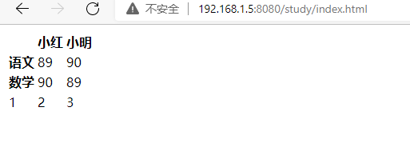

# 一、基础知识

* HTML历史

Tim Berners-Lee 一位伟大的人物，在1990年左右发明了万维网（www-world wide web）。同时发明了URL、HTML、HTTP，用自己写的浏览器访问了自己写的服务器。

* 制作网页需要的知识
	1. 域名
	2. HTTP服务器
	3. HTML
	4. 其他

### 万维网与互联网

一）万维网

**万维网**（**WWW**），俗称**网络**，是一个信息系统，其中的文件和其它网络资源被确定统一资源定位符（URL，例如`https://example.com/`)，它们可以通过超链接相互链接，并可通过Internet访问。【在万维网中，所有资源都有一个地址（URL），输入地址就可以通过互联网来访问这个资源。】

以上内容来自[维基百科](https://en.wikipedia.org/wiki/World_Wide_Web)。


二）互联网

在**因特网**（或**互联网**）是互连的全球系统的计算机网络，它使用因特网协议套件（TCP / IP协议）实现网络和设备之间的通信。它是一个*网络*，由本地到全球范围的私人、公共、学术、商业和政府网络组成，通过广泛的电子、无线和光网络技术连接。互联网承载种类繁多的信息资源和服务，如相互关联的超文本文件和应用程序的万维网（WWW），电子邮件、电话和文件共享。

以上内容来自[维基百科](https://en.wikipedia.org/wiki/Internet)


### HTML是什么


HTML（HyperText Markup Language，超文本标记语言）
Lee写的HTML诞生，[最初的HTML](https://www.w3.org/History/19921103-hypertext/hypertext/WWW/MarkUp/Tags.html)


### HTML5是什么？

1. 最新版的HTML，110个标签，含旧标签和32个新标签

2. HTML5和它的朋友们

   新标签、新属性

   新的通讯技术：WebSockets、WebRTC等

   离线存储技术：LocalStorage、断网监测

   多媒体技术：视频、音频

   图像技术：Canvas、SVG、WebGL

   Web增强技术：History API、全屏

   设备相关技术：摄像头、触摸屏

   新的样式技术：FlexGrid布局

   等


### 一些好用的工具

[JS Bin](http://js.jirengu.com/)       在线，单文件

[代码沙盒](https://codesandbox.io/)   在线，可多文件，速度慢

VSCode

WebStorm

资料：MDN

标准：W3C

教程：[网道HTML教程](https://wangdoc.com/html/index.html)


# 二、语法及标签


## （一）语法


   ```html
    <!DOCTYPE html>           //文档类型
    <tag attr=value>内容</tag>   //闭合标签
    <tag attr>内容</tag>      //没有value的attr，例如checked，写了也当没写
    <tag attr=value>         //自闭合标签
   ```


## （二）HTML起手式

Emmet !

   ```html
    <!DOCTYPE html>   //文档类型
    <html lang="en">  //语言   zh-CN中文简体
    <head>
        <meta charset="UTF-8">  //文件字符编码
        
<!-- 默认生成的meta:vp不完整
<meta name="viewport" content="width=device-width, initial-scale=1.0">
-->
        //meta:vp完整内容
        <meta name="viewport" content="width=device-width, initial-scale=1.0, minimum-scale=1.0, maximum-scale=1.0, user-scalable=no">    //meta:vp完整内容
        <meta http-equiv="X-UA-Compatible" content="ie=edge"> //IE使用最新内核
        

        
        <title>Document</title>
    </head>
    <body>

    </body>
    </html>  
   ```

`head`标签里的内容默认不显示在页面

## （三）章节标签

表示章节的层级 都是闭合标签
* `<article>`             文章

* `<header>`              头    //与<head>标签区分

* `<main>`                主要
* `<aside>`               旁支

* `<footer>`              脚

* `<section>`             章节

* `<h1>,<h2>,<h3>,<h4>,<h5>,<h6>`   文章各级标题

* `<p>`                   段落

* `<div>`                 块划分

* `<span>`                行内划分

   ```html
    <footer>&copy;版权所有</footer>
   ```


## （四）内容标签


### （1）有序列表 ordered list

   ```html
    <ol>
        <li> </li>   
        <li> </li>
    </ol>    
   ```


### （2）无序列表  unordered list

   ```html
    <ul>
        <li> </li>
        <li> </li>
    </ul>
   ```


### （3）描述列表  description list

   ```html
    <dl>
        <dt>HTML</dt> //被描述对象
        <dd>是一种超文本标记语言</dd> //内容
    </dl>
   ```


## （五）全局属性

- `class`                类       匹配“`.`”
- `contenteditable`      可编辑
- `hidden`               隐藏
- `id`                   不唯一的唯一    匹配“`#`”    在JS可以直接获取到元素，但是不能使用document关键字
- `style`                格式设置 JS会覆盖HTML，JS优先级高于CSS
- `tabindex`             tab键响应顺序 ，-1表示不要响应，0表示最后响应
- `title`                鼠标浮上显示完整内容


### reset.CSS  取消默认样式


```css
* {
    margin:0; 
    padding:0;
    box-sizing: border-box;
}
*::before,*::after {
    box-sizing: border-box;
}
h1,h2,h3,h4,h5,h6{
    font-weight:normal;
}
a {
    color: inherit;
    text-decoration: none;
}
input,button {
    font-family: inherit;
}
ol, ul {
    list-style: none;
}
table {
    border-collapse: collapse;
    border-spacing: 0;
}      //table border合并
```


# 三、重难点标签


## （一）a标签

* 属性
  * href          超链接
  * target      目标
  * download     下载，一些网页不支持
  * rel=noopener

```html
 <a href="" target="">这是一个a链接</a>
```


### （1）href属性取值

1. 网址  

   ```html
    <a href="https://google.com">谷歌</a>    //https
    <a href="http://google.com">谷歌</a>     //http
    <a href="//google.com">谷歌</a>          //默认继承，然后自动跳转到正确网址
   ```
   
2. 路径

   ```html
    <a href="/a/b/c"></a>         // 根目录，是指HTTP服务开启的目录，而不是硬盘根目录
    <a href="a/b/c"></a>          // 相对目录
    <a href="index.html"></a>     // 默认打开当前目录中的index.html文件
    <a href="./index.html"></a>   // 打开当前目录中的index.html文件
   ```

3. 伪协议

   * `javascript:代码；` 访问一段js代码

   ```html
    <a href="javascript:alert(1);">JavaScript伪协议</a>   
   ```
   >  一个点击之后什么都不会发生的a链接：
   >
   >  ```html
   >  <a href="javascript:;">空的伪协议</a> //访问一段空的JS代码，让页面什么都不做
   >  ```
   >   

   >  ```css
   >  <a href="">刷新</a>                  //点击a标签。页面会刷新
   >  <a href="#">回到最顶部</a>            //点击a标签。页面会回滚到最顶部
   >  ```


* `mailto:邮箱 ` 跳转到邮件应用
  
      ```html
       <a href="mailto:123456@qq.com">发邮件给我吧</a>
      ```
  
   * `tel:手机号`  跳转到拨号页面，一般用于手机访问
  
      ```html
      <a href="tel:123 4567 7654">打电话给我吧</a>
      ```
  
      
  


4. id
`href="#xxx"` 跳转到指定标签


### （2）target属性取值
1. 内置名字

`_blank` 在新页面打开

`_self ` 默认值，在本页面打开

`_top` 在最顶层打开

`_parent`  父级（上一级）


2. 命名

* Windows的name` 窗口的命名：如果有，就在该窗口打开；如果没有就自动新建一个窗口并以此命名

   ```html
    <a href="//baidu.com" target=xxx>baidu</a>
    <a href="//google.com" target=xxx>谷歌</a>
   ```

打开百度在新的窗口打开，并将窗口并命为xxx，（在控制台打印`window.name`会返回xxx），第二次点击谷歌就会在刚刚命名的xxx窗口打开

* iframe的name`  在指定的iframe打开


## （二）img标签（image）
发送get请求，展示一张图片

   ```html
    
   ```


### （1）属性

1. `alt` 可替换的，图片加载失败显示该内容
2. `src` 图片地址  可以是网络地址，可以是文件地址
3. `height` `width`只写其中一项，另一项根据图片宽高比自适应


### （2）事件
用来监听图片是否加载成功

`onload` 
`onerror`

   ```javascript
    <script>
        xxx.onload=function(){
            console.log("图片加载成功");
        };
        xxx.onerror=function(){
            console.log("图片加载失败");//抢救图
            xxx.src="/404.png";
        };
    </script>
   ```


### （3）响应式

`img {max-width:100%}` 所有在任何屏幕下宽度占满屏幕


## （三）table标签

表格
   ```html
    <table>
        <thead>
            <tr>
                <th></th>
                <th>小红</th>
                <th>小明</th>
            </tr>
        </thead>
        <tbody>
            <tr>
                <th>语文</th>
                <td>89</td>
                <td>90</td>
            </tr>
            <tr>
                <th>数学</th>
                <td>90</td>
                <td>89</td>
            </tr>
        </tbody>
        <tfoot>
            <tr>
                <td>1</td>
                <td>2</td>
                <td>3</td>
            </tr>
        </tfoot>
    </table>
   ```



`table`标签内只能有`thead`、`tbody`、`tfoot`三个标签，`<tr>`table row表行;`<th>`table head表头；`<td>`table data单元格数据。


* 相关样式
  * `table-layout` 列宽行高规则
  * `border-collapse ` 取消每个单元格间隙
  * `border-spacing  ` 设置单元格间隙大小


## （四）form标签（表单）

发送get或post请求，然后刷新页面


### （1）属性

1. `action` 跳转页面地址
2. `method` 控制是get还是post
3. `autocomplete`是否自动填充  on/off
4. `target`在哪个窗口跳转 


### （2）事件
`onsubmit`事件
点击提交按钮，触发该事件
前提是有一个提交按钮


**提交按钮子标签:**
* input:输入框做提交按钮

   ```html
    <input name="" type="submit" value="提交">
   ```
* button按钮

   ```html
    <button type="submit">
       <strong>提交</strong>
    </button>
   ```
   

区别：input不可内嵌各种标签；button可内嵌其他标签，如`<strong>`  ``等


## （五）input标签
输入


### （1）属性 


type类型:
color、button、checkbox多选框、email、file可选一个文件，mulyiple可选多个、hidden隐藏，给机器看的、number、password密码、radio单选、search、submit、tel、text文本（默认项）
其他属性：name、autofocus、checked、disabled、maxlangth、pattern、value、placeholdor……


### （2）事件

`onchange`改变输入触发  
`onfocus`鼠标集中触发
`onblur`鼠标移开触发


## （六）其他标签

* ` <hr>`分割线 

* ` <br>`换行

* `<em></em>`   强调  斜体

* `<strong></strong>`加粗

* `<pre></pre>`保留空格、回车、换行

* `<code>这里可以写代码</code>`原样显示，字体等宽

* `<quoto></quoto>`内联引用 

* `<blockquote></blockquote>`块级引用  

* `<iframe>`内联框架元素，可以将另一个HTML标签嵌入到当前页面中

* `textarea` 一个比较大的输入框，可输入多行内容，右下角可拖动改变输入框大小`style="resize:none;"`使其固定

* `select`  下拉选框
  
   ```html
    <select>
        <option value="1">1</option>
        <option value="2">2</option>
    </select>
   ```
   
* `label`

* `video`视频

* `audio`音频

* `canvas`画画

* `svg`矢量画

* `nav`导航栏可以加列表链接地址等

* `template`用来容纳其他各种标签[用法](https://github.com/FrankFang/wheels/blob/master/lib/dom/index.js)


最后附上一个[HTML裸奔页面](https://gretahu10.github.io/html_demo/index.html)
