# 一、什么是HTTP？

HyperText Transfer Protocol：超文本传输协议

我们在什么时候会用到HTTP呢？

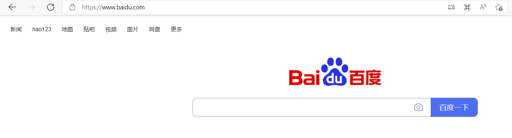

在浏览页面时会输入一串我们想要浏览的信息的URL，最开始就用到了http。

在**万维网**（**WWW**）中，所有资源都有一个地址（URL），输入地址就可以通过互联网来访问这个资源。

由HTTP**客户端**（user agent）发起一个请求，创建一个到服务器指定**端口**（默认是80端口）的**TCP**连接。HTTP**服务器**（origin server）则在那个端口监听客户端的**请求**。一旦收到请求，服务器会向客户端**返回**一个状态，比如"HTTP/1.1 200 OK"，以及返回的内容，如请求的文件、错误消息、或者其它信息。

* HTTP是万维网的数据通信的基础。
* HTTP 遵循客户端-服务端模型。
* 通常基于TCP/IP 层，但它可以在任何可靠的传输层上使用
* HTTP是一个客户端（用户）和服务端（网站）之间请求和应答的标准。
* HTTPS：HTTP协议的安全版。

# 二、URL

URL统一资源定位符（Uniform Resource Locator）

独特资源在Web上的<strong>地址</strong>。

## 组成

URL具体包括几部分：

协议+域名/IP+端口号+路径+查询字符串+锚点

```http
http://www.example.com:80/path/to/myfile.html？key1=value1&key2=value2#SomewhereInTheDocument
```

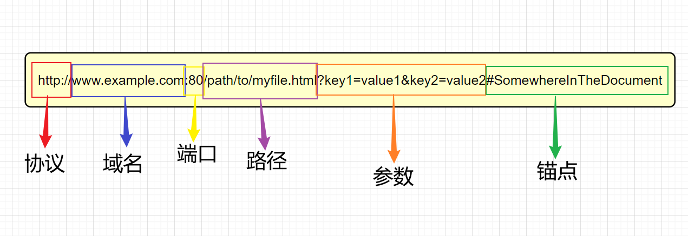


* **协议**：它表明了浏览器必须使用何种协议。它通常都是HTTP协议或是HTTPS。Web需要它们二者之一，但浏览器也知道如何处理其他协议，比如`mailto:`（打开邮件客户端）或者 `ftp:`（处理文件传输）。
* **域名/IP**：它表明正在请求哪个Web服务器。或者，可以直接使用IP address,但是因为它不太方便，所以它不经常在网络上使用。
* **端口**(port)
* 网络服务器上资源的**路径**：用以请求不同的页面。
* 提供给网络服务器的额外**参数**：可以在同一个页面请求不同内容。 这些参数是用 `&` 符号分隔的键/值对列表。在返回资源之前，Web服务器可以使用这些参数来执行额外的操作。每个Web服务器都有自己关于参数的规则，唯一可靠的方式来知道特定Web服务器是否处理参数是通过询问Web服务器所有者。

* 资源本身的另一部分的**锚点**：定位内容的不同位置`＃`后面的部分（也称为片段标识符）。不会发送到请求的服务器。

### 1、IP

Internet Protocol，**互联网协议**，是用于分组交换数据网络的协议。

IP的任务是根据源主机和目的主机的地址来传送数据。为此目的，IP定义了**寻址方法**和**数据报的封装结构**。

#### 1）如何定位一台设备

* 通过路由器连接内网和外网
  
     * 外网IP：租用宽带，路由器连上电信服务器，路由器会有一个外网IP `ip138.com`可查看外网IP
     
     * 内网IP：由路由器创建，路由器会给每一个内网中的设备分配不同的内网IP`ipconfig`可查看内网IP
     
       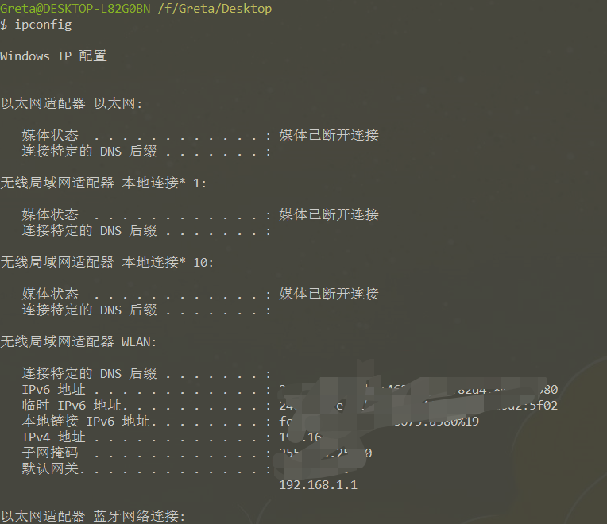


#### 2）特殊IP

127.0.0.1   表示自己

localhost   通过host指定为自己

0.0.0.0       不表示任何设备

host文件    C:\Windows\System32\drivers\etc\hosts

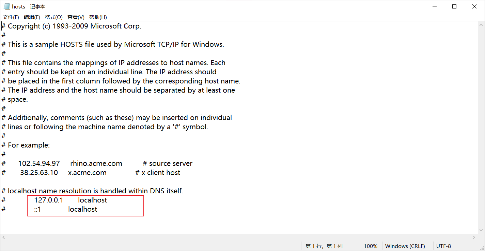


### 2、域名

域名：以`.com/.net/.org`结尾的字符串。它表明正在请求哪个Web服务器。

#### 1）小知识

(一)域名主要分为三类：

* 第一类是通用顶级域名（General top Level Domain，简称gTLD）主要包括：
     * `.com`代表商业机构
     * `.net`代表网络组织
     * `.org`代表非盈利组织等一共22个通用顶级域名。

* 第二类是国家及地区代码顶级域名(country Code Top Level Domain，简称ccTLD)主要包括：
     * `.cn`中国域名
     * `.us`美国域名
     * `.hk`英国域名等一共308个国别域名

* 第三类是2011年“新通用顶级域名”的计划实施以来新增的新通用顶级域名（New Generic Top-level Domain，简称NEW gTLD）主要包括：
     * `.bike`自行车域名
     * `.car`汽车域名
     * `.run`跑步域名等六、七百个新顶级域名

(二)域名等级<br/>
* `com`是顶级域名
* `baidu.com`是二级域名，俗称一级域名
* `www.baidu.com`是三级域名，俗称二级域名
* 一级域名与二级域名是父子关系，可以分属不同公司
     * `github.io`免费把子域名`userid.github.io`给个人使用


#### 2）使用方法

* 一个域名可以对应不同IP，负载均衡
* 一个IP对应不同域名，共享主机
* 查看域名对应的IP可以使用`ping`命令
  * `ping`是个软件，来源是乒乓，ping出去希望收到回复pang

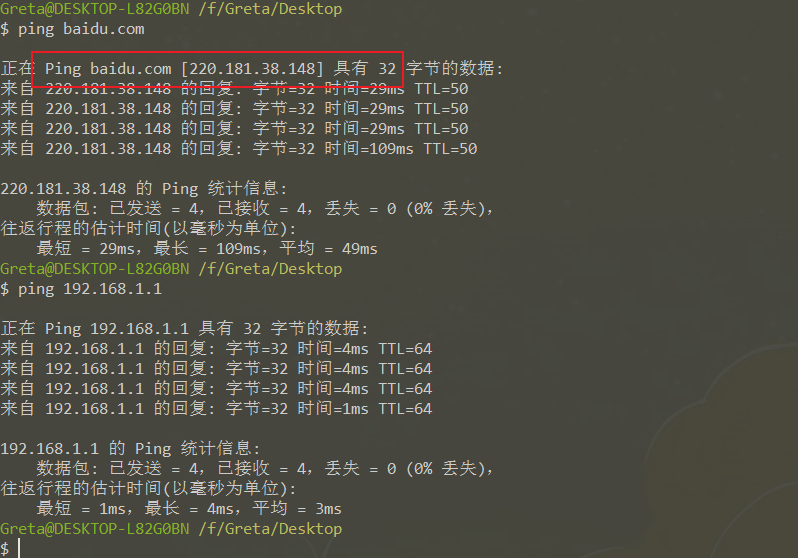


### 3、DNS

域名系统（Domain Name System，缩写：DNS）是互联网的一项服务。它作为将域名和IP地址相互映射的一个分布式数据库。DNS使用TCP和UDP端口53。

- IP：用来定位一台设备

  端口：定位一个设备的服务

  DNS：把域名和IP对应起来

  

#### 响应过程

输入`baidu.com` 发生了什么：

1. 浏览器项向电信提供的DNS服务器询问对应什么IP     

   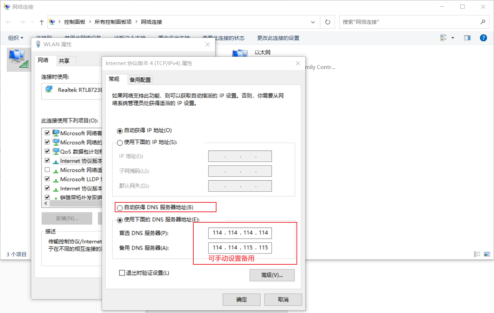

2. 电信回答一个IP `nslookup`

   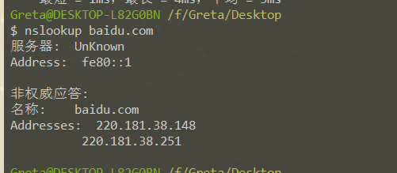

3. 浏览器向对应IP的端口发送请求

4. 请求内容：查看baidu.com的首页 Response是响应内容

   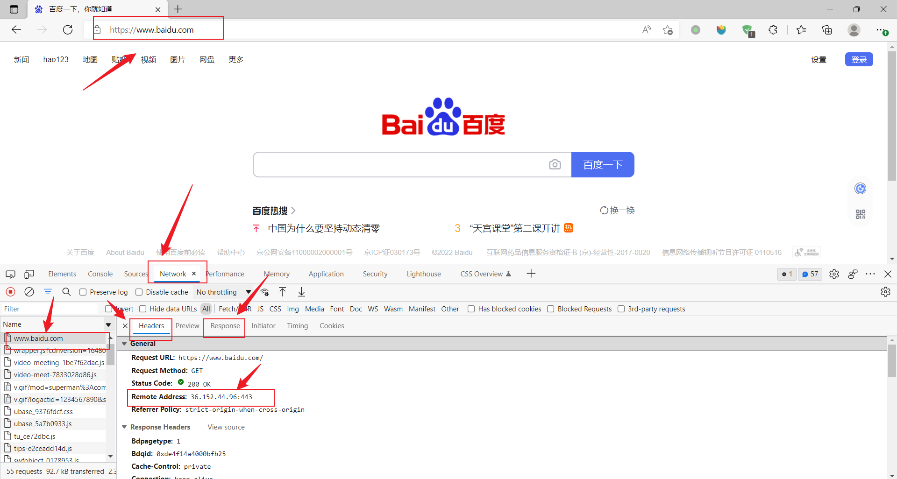


### 4、端口

**端口port**

服务器提供不同的服务，每个服务一个号码，这个号码就是端口号。 

#### 1)常用端口

HTTP：80端口

HTTPS：443端口

FTP：21端口

共有65535个端口

端口列表:[TCP/UDP端口列表 ](https://zh.wikipedia.org/wiki/TCP/UDP端口列表)


#### 2)使用规则

* 1-1023号端口是留给系统使用的，使用需要管理员权限
* 端口不能重复占用，一个端口被占用，只能换一个端口
* `-p`参数可以修改端口
  * `http-server`默认使用8080端口
  * 代码`http-server -p 1122`使用1122号端口开启http-server服务

* 如果Web服务器使用HTTP协议的标准端口（80和443）来授予其资源的访问权限，则通常会被忽略，否则是强制性的。
* **IP和端口缺一不可**


# 三、报文结构


## （一）请求

### 1）如何发送请求
* 使用浏览器发送请求     直接输入网址
* 使用`curl`命令发送请求

### 2）请求报文
请求报文分为四部分，分别是请求行、请求头、空行以及请求体，空行是用来区分请求头与请求体

```bash
> 请求动词 路径+查询参数 协议/版本号
> Host:域名或IP
> User-Agent:客户代理
> Accept:text/html;  //接受什么格式的内容
> 
> Content-Type:请求体的格式
```


* 请求行
  
     第一行内容
     
     * 请求动词：常用GET和POST
     
* 请求头

     空行以上
     
* 请求体 （上传内容）

    * GET请求一般没有请求体


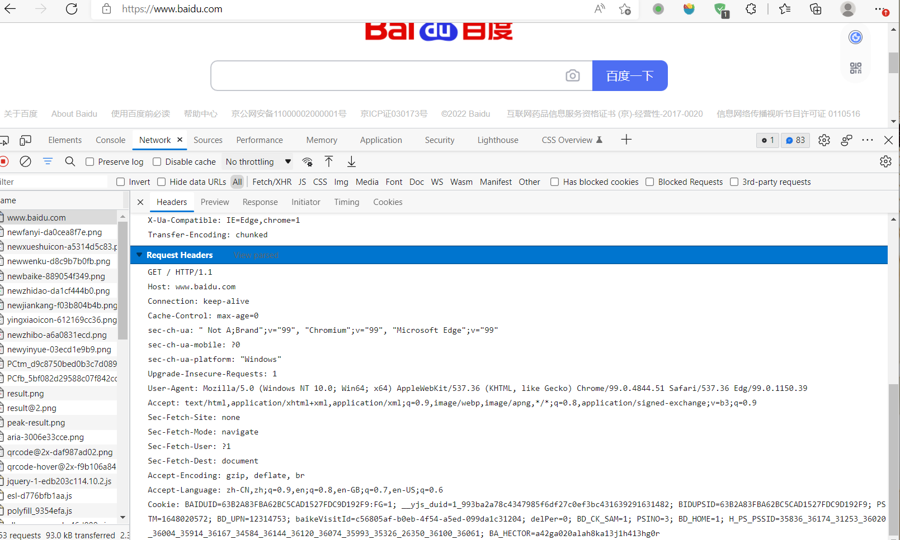


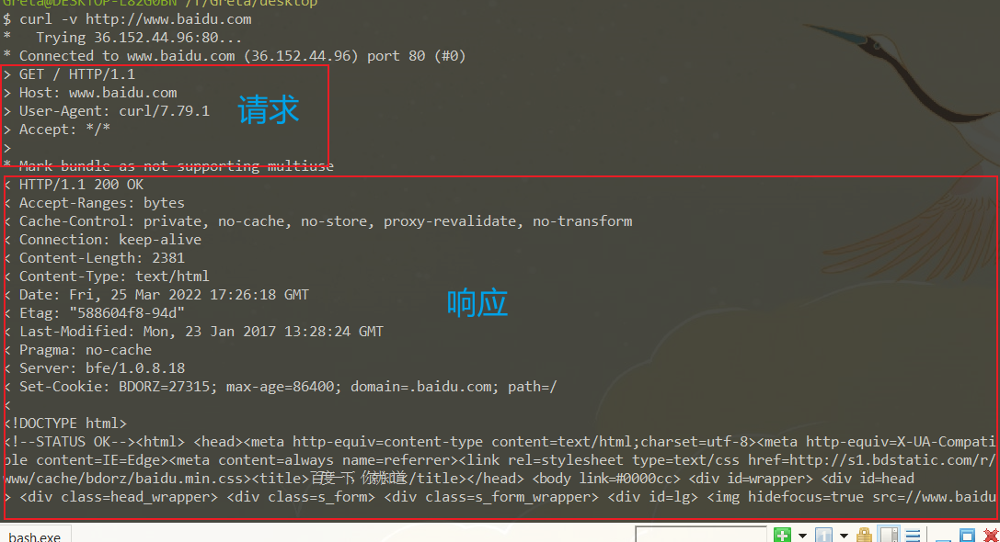


## （二）响应

### 响应报文
响应报文同样分为四部分，分别是状态行（响应行）、响应头、空行以及响应体

```bash
> 协议/版本号 状态码 状态字符串
> Content-Type: text/css;charset=utf-8   // （响应体的格式）
> Date: Wed, 27 May 2020 09:33:49 GMT
> Connection: keep-alive
> Transfer-Encoding: chunked
> 
> 响应体（下载内容）
```


* 响应行
  
     也叫状态行，第一行内容
     
     * 协议/版本号：当前HTTP协议以及版本号
     
     * 状态码：3位数字组成
     * 状态字符串：描述状态的短语。
     
     
     
* 响应头
* 响应体 （上传内容）

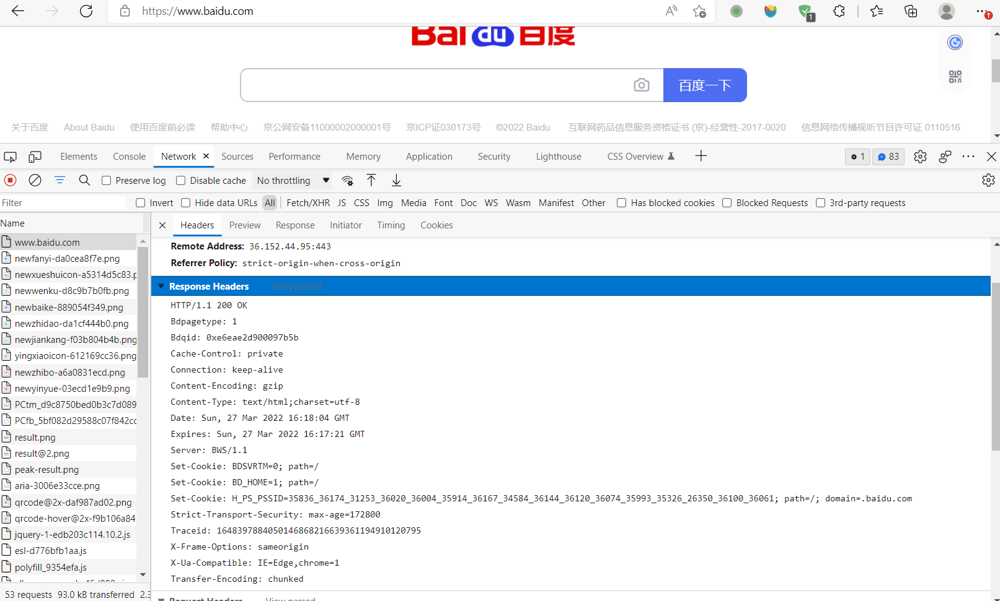


## （三）实现

### 1）用`curl`构造请求

```
curl -v -X POST --header 'Frank:Good' -H 'Content-Type:text/plain;charse=utf-8' -d '请求体内容' http://localhost:8888/xxxx?wd=hi#nihao
```
* `-v`  参数输出通信的整个过程，用于调试。

* `-X`  设置请求动词
  
    * `-X POST` 
    
* `-H`等同于`--header`   设置请求头
  
    * `--header 'Frank:Good' -H 'Content-Type:text/plain;charse=utf-8'`
    
      两行请求头，第一行为随意的`key:value`键值对，第二行表示我要上传纯文本
    
* 设置路径和查询参数:加在URL后面
  
    * `http://localhost:8888/xxxx?wd=hi#nihao`
    
      注意：锚点不会上传到服务器
    
* `-d`等同于`--data`  设置请求体:
  
    * `-d '请求体内容'`请求内容，一般用在`POST`
    * 使用`-d`参数以后，HTTP 请求会自动将请求转为 POST 方法，因此可以省略`-X POST`。

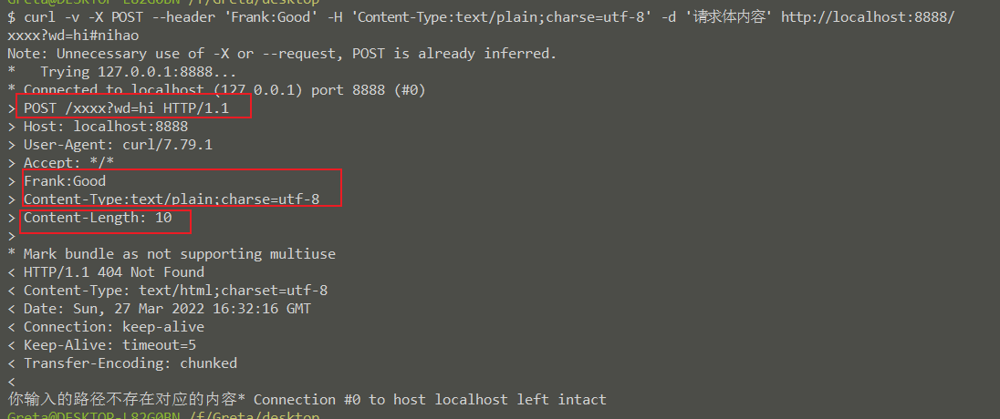


### 2）用`Node.js`读取请求

* 读取请求动词
    * `request.methed`
* 读取路径
    * `request.url`路径带查询参数
    * `path`纯路径
    * `query`纯查询参数
* 读取请求头
    * `request.headers`
    * 可加参数

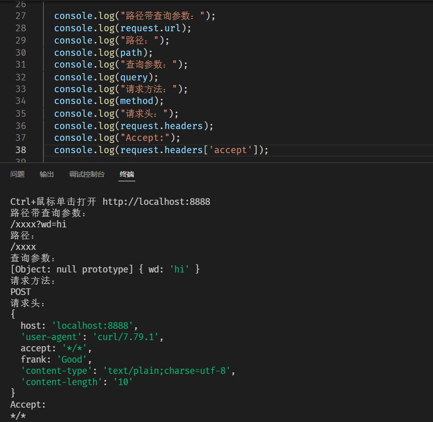


### 3）用`Node.js`设置响应

* 设置响应状态码
    * `response.statusCode = 200`
    
* 设置响应头
  
    * `response.setHeader('Content-Type','text/html;charset=utf-8')`
* 设置响应体
  
    * ```
      response.write(`小波浪点，可回车，可追加内容，可多次写`)
      ```
    


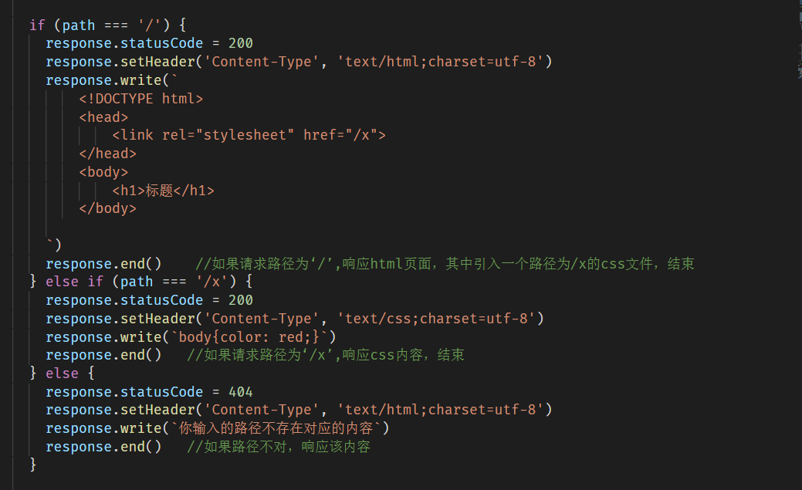


# 四、几个问题

## （一）请求动词有哪些


- http/1.1规定的请求动词有以下几种:
  - GET: 请求指定资源
  - POST: 发送数据给服务器
  - PUT: 使用请求中的负载创建或者替换目标资源
  - PATCH: 对资源进行部分修改
  - DELETE: 删除资源
  - HEAD: 获取资源的元信息
  - OPTIONS: 列出可对资源实行的请求方法，用来跨域请求

## （二）GET和POST的区别


## （三）状态码

状态代码的第一个数字代表当前响应的类型：

- [1xx消息](https://zh.wikipedia.org/wiki/HTTP状态码#1xx消息)——请求已被服务器接收，继续处理
- [2xx成功](https://zh.wikipedia.org/wiki/HTTP状态码#2xx成功)——请求已成功被服务器接收、理解、并接受
- [3xx重定向](https://zh.wikipedia.org/wiki/HTTP状态码#3xx重定向)——需要后续操作才能完成这一请求
- [4xx请求错误](https://zh.wikipedia.org/wiki/HTTP状态码#4xx请求错误)——请求含有词法错误或者无法被执行
- [5xx服务器错误](https://zh.wikipedia.org/wiki/HTTP状态码#5xx服务器错误)——服务器在处理某个正确请求时发生错误

虽然 [RFC 2616](https://tools.ietf.org/html/rfc2616) 中已经推荐了描述状态的短语，例如"200 OK"，"[404 Not Found](https://zh.wikipedia.org/wiki/HTTP_404)"，但是WEB开发者仍然能够自行决定采用何种短语，用以显示本地化的状态描述或者自定义信息。

[HTTP状态码](https://zh.wikipedia.org/wiki/HTTP状态码)

