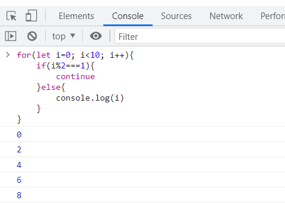

# 一、JS诞生及发展

从网景到微软，从Firefox到IE，再到Chrome，网络公司的兴衰更迭也同样是浏览器的更新发展。JS应运而生！

1994年：

* 网景公司发布了历史上**第一个比较成熟的网络浏览器**，但是，这个浏览器不具备与访问者互动的能力。网景公司急需一种使得浏览器可以与网页互动的网页脚本语言，

1995年：

* Java强势推出。

* 4月，网景公司录用了系统程序员**Brendan Eich**。

* 5月，网景决定未来的网页脚本语言必须**看上去与Java足够相似**，但是比Java简单，使得非专业的网页作者也能很快上手。

  Brendan Eich 被指定为这种"简化版Java语言"的设计师。为了应付公司安排的任务，他借鉴了各种语言，只用**10天**时间就把Javascript设计出来了。

* 所以，Javascript语言实际上是**两种语言风格的混合产物**----（简化的）函数式编程+（简化的）面向对象编程。这是由Brendan Eich（函数式编程）与网景公司（面向对象编程）共同决定的。
由于设计时间太短，语言的一些细节考虑得不够严谨，导致后来很长一段时间，Javascript写出来的程序混乱不堪。

* Javascript的发展非常快，没有时间调整设计。

1996年：

* 8月，微软公司强势介入，宣布推出自己的脚本语言Jscript；**浏览器大战开始**
* 11月，为了压制微软，网景公司决定申请Javascript的国际标准；

1997年：

* 6月，第一个**国际标准**ECMA-262正式颁布。

  也就是说，Javascript推出一年半之后，国际标准就问世了。设计缺陷还没有充分暴露就成了标准。

  Javascript目前是网页编程的唯一语言，只要互联网继续发展，它就必然一起发展。目前，许多新项目大大扩展了它的用途

* JS：JavaScript，其标准是ECMAscript，也就是ES。
   ES是纸上的标准，JS是在浏览器上的实现。

1998年：

* 网景被收购，反击失败                        网景进行开源，也就是Firefox出现

1999年：

* 12月，**第三版标准**发布，使用于之后发布的IE6，一度成为使用最广的标准

2001年：

*  **IE6捆绑Windows XP**发布，一度火爆，对市场松懈。Firefox卷土重来，抢占一部分市场，

2004年：

* 鹬蚌相争之际，**Chrome**开始出现
* 使用V8引擎，以超快速浏览为由抢占市场
* 愚人节，谷歌发布**Gmail**在线网页，**JS开始兴起**

2005年：

* Jesse将谷歌用到的技术命名为AJAX，前端开始玩概念，**前端**技术正式出现

2006年：

* 主流浏览器为IE6和Firefox
* **jQuery**发布，是目前最长寿的JS库，可以支持IE等多款浏览器，在之后十年大放异彩，IE的衰落降下了jQuery的热度

2009年：

* 12月，**第五版**发布，增加一些新功能，
* Chrome V8引擎快如闪电，Ryan基于V8创建了**Node.js**。
* 第三版标准和第五版标准之间的第四版，由于添加太多功能，浏览器跟不上，导致流产

2010年：

* iPhone4发布 **智能手机**崛起，IE开始衰败
* Isaac基于Node.js写出来**npm**，前端工程师可以在浏览器之外执行js了，Node.js快速风靡
* TJ受Sinatra启发，发布**Express.js**，前端工程师可以愉快地写**后端**应用。 期间爆发出很多技术，风靡之后逐渐沉寂 

2011年：

* Nokia联合微软，手机上捆绑IE，Nokia逐渐完结，IE在手机市场逐渐缩小，

2015年：

* 6月，**第六版标准**发布，新浏览器都支持，成为目前使用最广泛的标准 也就是ES6
* 之后每年一版，以年份命名

2016年：

* **中国**市场：淘宝天猫宣布不在支持IE6、7、8，IE在手机端彻底消失，前端开始急速发展
* Chrome占有全球62%的市场 


最后：JS低开高走，成为历史的选择


# 二、理论基础

## 1. DOM操作慢

* 浏览器的渲染引擎和JS引擎是分开的

* JS是单线程的

* 跨线程通信，使得JS可以渲染

所以DOM操作慢


## 2. JS引擎主要功能：

* 编译：翻译成机器语言

* 优化：改写

* 执行

* 垃圾回收：内存回收


## 3. JS运行前提

### （1）浏览器提供的：

API，例如：`window`/`document`/`setTimeout `   这些不是JS自身具备的功能，是浏览器集成的**运行环境** runtime environment


### （2）JS代码执行 ——内存

下载JS代码，并在内存中运行，在内存的哪里呢

以下面代码为例:

```js
let p = {name:'frank',age:'18'}
let person=p
person.name='jack'
console.log(p.name)
```


**数据保存规则：**

* 数据分两种：非对象和对象
  * 非对象都存在Stack栈区，顺序存放
  * 对象都存在Heap堆区，随机存放

对象都存在Heap堆区，随机存放

* `=` 总是会把右边的东西复制到左边

* **对象被篡改了:：**`person`和`p`共用同一块内存（`person`复制了`p`的地址），因此`person`修改，`p`也会变化


### （3）JS运行之前

要准备很多东西，比如`console`、`document`、对象`Object`、数组`Array`、函数`Function`，全部挂到`window`上，挂到`window`上就可以直接使用

* `window变量`和`window对象`是两个东西

* 变量是一个容器，存放对象 的地址

* 对象是heap里的数据


# 三、JS语法

## 1. 基本概念

### （1）表达式与语句

* 表达式一般有值，语句可能有也可能没有
* 语句一般会改变环境（声明、赋值）


### （2） 值与返回值

* 只有函数才有返回值


* 举个栗子
     *  `1+2`表达式的 **值** 为`3`
     * `add(1,2)`表达式的值为函数的**返回值**
     * `console.log`表达式的值为函数本身
     * `console.log(3)`表达式的值为`undefined`，`3`只是**打印**出来的数值
     * `var a = 1` 是一个语句


## 2. 书写规则

* **大小写敏感**
* 大部分空格没有实际意义，只要不影响断句
* 加回车大部分时候也不影响，但是return后面不能加回车，加回车会自动补充`undefined`


## 3. 标识符

* 第一个字符可以是 Unicode字母 / $ / _ / **中文** ,一般下划线最多用两个，数字不能在第一位
* 标识符一般用在变量名


## 4. 注释

* 注释一般有两种
```js
// 单行注释

/*
多行
注释*/
```
* 注释不要写废话
* 好的注释
     * 采坑注解
     * 特殊需求
     * 遇到bug以及解决方法


# 四、JS语句
## 1. 区块block
简单来说就是用花括号把一些代码包起来
```js
{
    let a = 1
    let b = 2
}
```
在下面的这些语句中经常用到


## 2. 条件语句
### （1）if语句

#### 写法

```js
if (表达式){
    语句
}else if (表达式){
    语句
}else{
    语句
}
```
```js
function fn(){
    if (表达式){
      return 表达式
    }if (表达式){
      return 表达式
    }
    return表达式
}
```


#### 问题

正确写法：

```js
let a = 1
if(a === 2)
    console.log('a')
console.log('a不是2')
```


那么以下四种情况分别出现什么结果：

```js
let a = 1
if(a === 2)
    console.log('a')
    console.log('a不是2')
```

```js
let a = 1
if(a === 2)
    console.log('a')  console.log('a不是2')
```

```js
let a = 1
if(a === 2)
    console.log('a'), console.log('a不是2')
```

```js
let a = 1
if(a === 2)
    console.log('a'); console.log('a不是2')
```


### （2）switch语句

```js
switch(表达式){
    case "语句1":
    case "语句2":
       break;
    case "语句:3":
       break;
    default:
}
```


### （3）问号冒号表达式

简化的if else语句

```js
a>b ? a : b      //a>b吗，如果是，就选a，不是，就选b
```


### （4）逻辑运算符

短路逻辑

#### 1）&&

表格中间内容为`A&&B`的值

| &&      | B真  | B假  |
| ------- | ---- | ---- |
| **A真** | B    | B    |
| **A假** | A    | A    |


取第一个假值

不会是`true`或者`false`，会取表达式代替，比如`A&&B`，`A`为`false`，那么表达式的值就为`A`


#### 2）||

| \|\|    | B真  | B假  |
| ------- | ---- | ---- |
| **A真** | A    | A    |
| **A假** | B    | B    |

与&&相反，取第一个真值


## 3. 循环语句 

### （1）while循环
#### 1）执行逻辑：

判断表达式的真假，真执行语句，再判断；假，跳过

#### 2）组成

共四部分，声明变量，判断，循环体，变化，缺一不可

```js
while(表达式){
 语句 
}
```
不要写死循环，例如
```js
let a=0.1;
while(a!=1){
    console.log(a)
    a=a+0.1
}  //浮点数不精确，永远不会等于1,
```


#### 4）衍生

do...while循环    


### （2）for循环

(while循环的简写)

```js
for(语句1；表达式2；语句3){
    循环体
}
```
#### 1）执行逻辑

先执行语句1（初始化） ，判断表达式2：
真：执行循环体，执行语句3（变化）
假：退出循环

#### 2）一个例子

```js
for (var i = 0;i<5; i++){
    setTimeout(()=>{console.log(i)})
}
```

会出现五个5

>  题外话：
>
> `var`改成`let`就正常了
>
> 《知乎：方应杭——[我用了两个月的时间才理解 let](https://zhuanlan.zhihu.com/p/28140450)》


### （3）break和continue

#### 1）break

跳出当前`for`循环

只跳出当前`for`循环，如果嵌套*父子*两个`for`循环，`break`在`子for`循环上，那只会跳出`子for`循环，`父for`循环还会继续循环

```js
for(let i=0; i<10; i++){
    if(i%2===1){
        break
    }else{
        console.log(i)
    }
}
```

i对2取余，得到1，就跳出整个循环，最后输出0


#### 2）continue

跳出当前内部循环，进行下一次循环

```js
for(let i=0; i<10; i++){
    if(i%2===1){
        continue
    }else{
        console.log(i)
    }
}
```
i对2取余，如果是1，就跳过当前循环，进行下一次循环

最终得到：



### （4）label语句

标记语句

语法：

```js
a:{
    console.log(1);
    break a;
    console.log(2);
}
console.log(3);
```


一个标识符标签后面跟一个代码块，只是个label标签，并不是对象，没有实际意义

以上代码执行结果是输出1和3


```js
{
    a: 1;
}
```


这是个代码块，a是个label标签，只有一句话，叫做1，没有任何意义，什么也不做，也没有生成对象


label标签没有引号

加分号表示断句

配合break和continue使用


点击查看[文档](https://developer.mozilla.org/zh-CN/docs/Web/JavaScript/Reference/Statements/label)

# 五、教材推荐

[阮一峰 : 网道教程](https://wangdoc.com/javascript/)

《你不知道的JavaScript——上卷》


代码规范

所有构造函数（专门用于创建对象的函数）首字母大写

所有被狗仔出来的对象，首字母小写


词性

new后面的函数使用名词形式

比如 new Person()、new Object()

其他函数，一般使用动词开头

createSquare(5)、createElement('div')