# 一、项目简介

卡通人物制作

CSS3+ES6综合应用

使用 JS 来逐步加载 CSS 代码，呈现**动态**效果

## （一）使用说明

1. 代码播放部分有四个按钮，可以控制**播放速度**
   * 暂停
   * 播放     也是中速播放按钮
   * 慢速     慢速播放
   * 快速     快速播放
2. 卡通人物部分
   * 鼠标浮动到鼻子上可以左右晃动
3. 源码部分，可以实现画任意形象
   * HTML部分更改 `preview-wrapper`部分
   * CSS 部分写入css.js的 字符串当中
   * 最终按钮以及呈现与示例一致，实现脚本功能


## （二）技术栈

* CSS3布局与定位 

* CSS3 transform

* JS DOM 操作


## （三）制作大纲

1. 选择模仿目标

   codepen.io[Pikachu (codepen.io)](https://codepen.io/TeorikDeli/pen/YzBMwr)

   

2. HTML和 CSS画出来

3. JS 动起来

4. 代码优化，作品调整

5. 部署


# 二、HTML和CSS

## （一）项目搭建

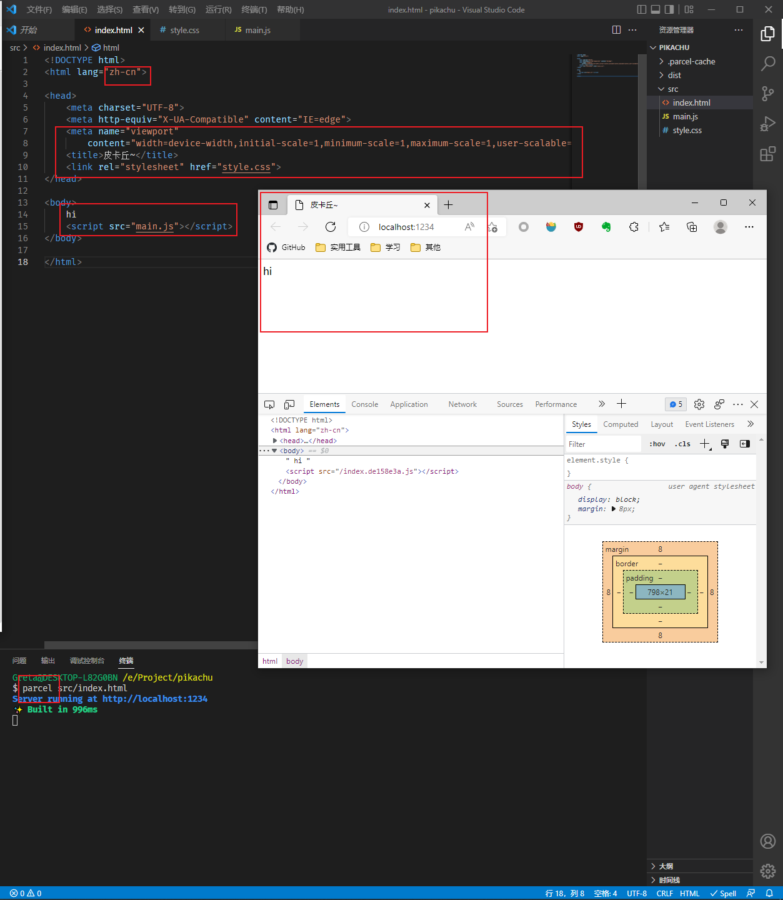


初始化成功

使用 `parcel` 进行打包

CSS3 和 ES6  项目，用不到 JS ，引入空的 JS 文件是由于 `parcel` 可能会出错

## （二）定位布局

考虑定位布局，都是左右对称，所以，相对中线定位？

先做最中间的鼻子

扇形的鼻子？

可以三角形加半圆？试试

三角形是方形 border 的1/4，那扇形可以是圆形 border 的1/4

水平居中

> 制作过程看动画吧


# 三、JS

## （一）动起来

让代码动起来：原理简单解释一下就是以 **动态** 的过程同时把 css 文本内容放到 html `<pre>` 标签中和`<style>`标签中

动态加载采用`setInterval`

当 `n>string.length` 时，清除计时器，动画停止

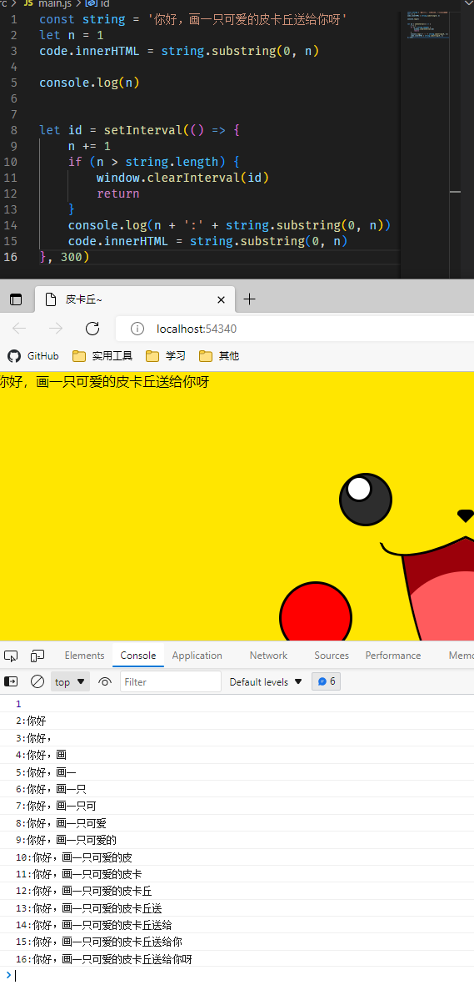

## （二）布局调整

### 1. 代码动画与卡通人物进行上下分隔

```css
#preview-wrapper {
    position: fixed;
    bottom: 0;
    left: 0;
    width: 100%;
    height: 50vh;
}

#code-wrapper {
    position: fixed;
	top: 0;
	left: 0;
	width: 100%;
	height: 50vh;
}
```

### 2. 隐藏滚动条，但是仍然可以向上滚动查看代码

```css
#code {
    position: absolute;
    top: 0;
    left: 20px;
    width: calc(100% - 20px);
    height: 50vh;
    margin-top: 0;
    overflow-y: auto;
}
#code::-webkit-scrollbar {
    display: none;
}
```

### 3. 代码滚动时一直显示最下面一行

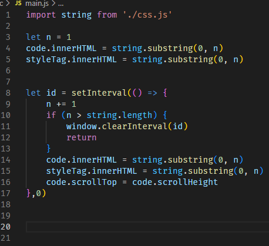


## （三）添加按钮

用按钮进行播放速度控制

css就不展示了

想法是设置暂停键、播放键、慢中快三种速度键

每次点击按钮都会清除原来的计时器，重新设置一个计时器

每次点击时，n要继承原来的数值

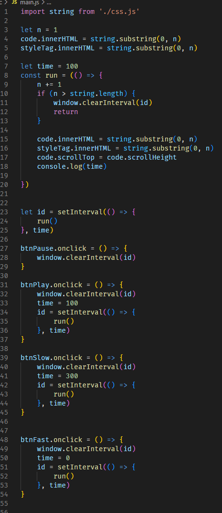


## （四）出了个小问题

当点击慢速，再点击播放时，是两个字一起往外蹦的，而 time 是以 100ms 的速度打印 300，

据分析是因为播放按钮没有 `clearInterval`  ，那么，慢速的 time 是 300，再加上播放的 100，就是两个time一起生效

所以播放按钮也要先 `clearInterval` ，清除过后就还要再设置time，就和Mid中速按钮一样了

所以，取消中速按钮，播放按钮的功能做到和中速一样

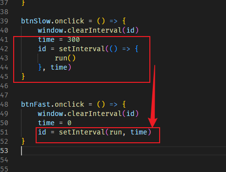


## （五）代码优化

代码太丑了，重复即丑

### 1. 简单优化

思考

```js
const x = ()=>{
    run()
}
```

x和 run是否等价

是的

所以简化

简化后

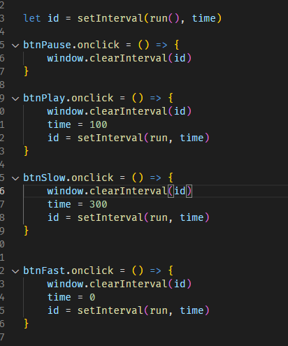


### 2. `setInterval` 重复，简化

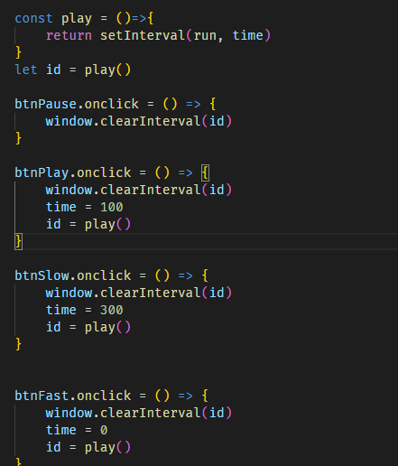

### 3. `clearInterval` 重复

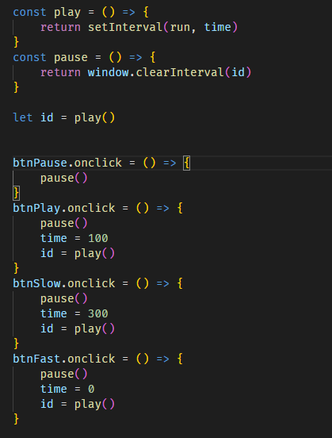

### 4. id 重复

id ...... 不能干掉

play和pause都需要操作id

### 5. 函数式

思路：把一堆代码抽到一个函数，然后调用这个函数

```js
btnSlow.onclick = () => {
    pause()
    time = 300
    id = play()
}
```

简化

```js
const slow = ()=>{
    pause()
    time = 300
    id = play()
}
btnSlow.onclick = ()=>{
    slow()
}
```

继续简化

```js
const slow = ()=>{
    pause()
    time = 300
    id = play()
}
btnSlow.onclick = slow
```

简化结果：

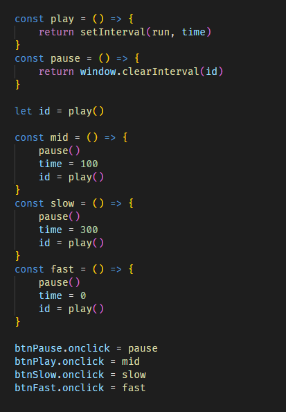

运行检验一下，很流畅，没问题

### 6. 面向对象

操作的都是播放器，面向对象继续优化

把几个函数放到一个对象里

并规范代码

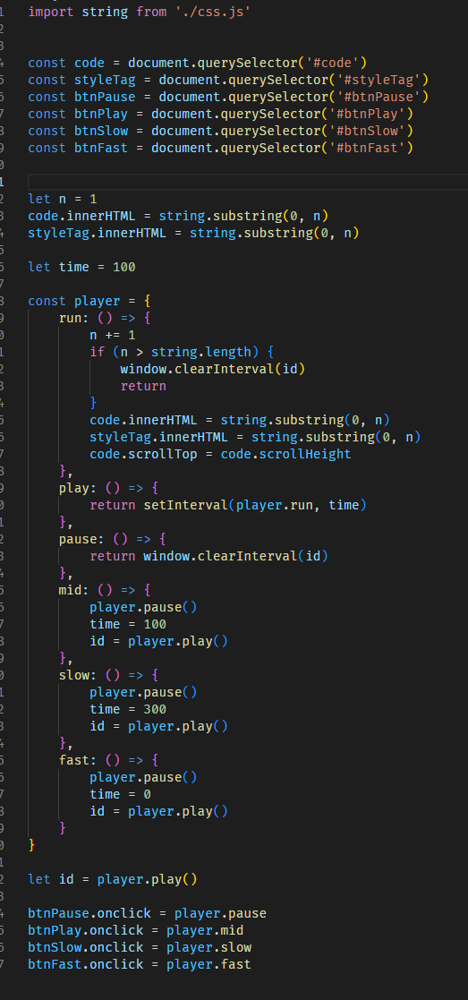


### 7. 初始化方法

现在只是把方法优化了

属性什么的还没有搞

一般一个对象都有一个初始化方法

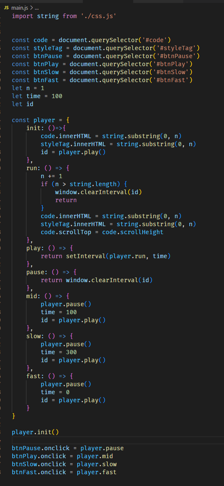

### 8. 内置id返回值

每次调用 `play()` 的时候，都把 `play`的返回值给了 `id` ，那就在 `play` 那里，内置这个功能

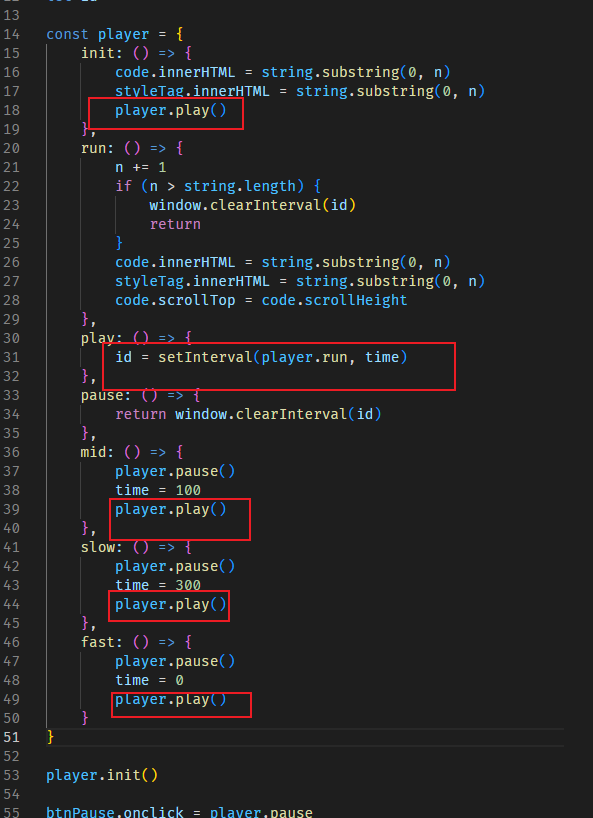

### 9. 函数绑定

绑定函数也是属于初始化的过程

放进去!

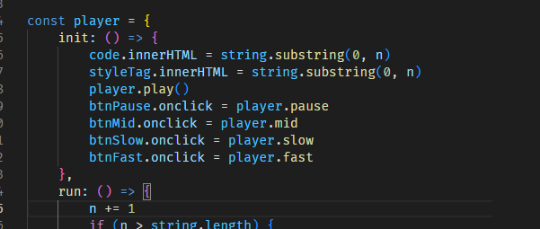

绑定事件出来，放到一个函数里

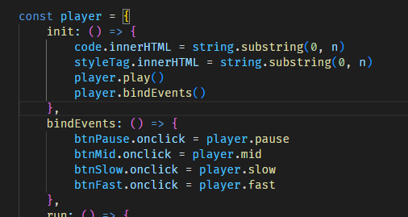

### 10. 哈希简化

事件绑定代码差不多，只有id和函数名不一样，抽到一个哈希表里，然后遍历这个哈希

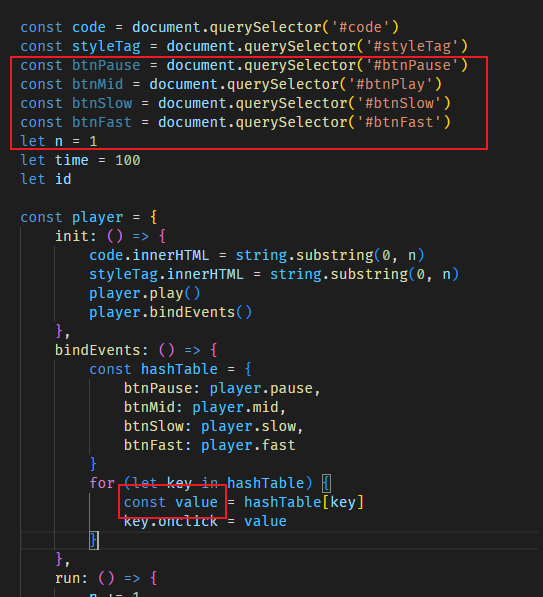

两个框，`document.querySelector` 可以放到遍历时候一起加

value声明后只用了一次

继续简化

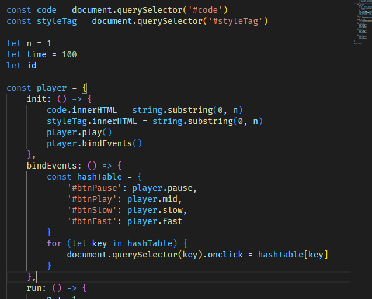

hashTable可以提出来

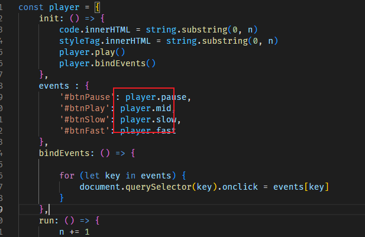

### 11. 改bug

申明player的时候就用了player

这时候player是undefined

举例：声明 a 的时候就用到了 a ，那么用到 a 的地方就成了 `undefined`

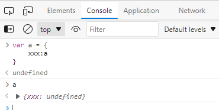

放里面 `bindEvents` 是后执行的，在 `player.init() ` 的时候才执行

抽出来就是在声明的时候就用到了 `player`

**解决方法**：不用 `player`，直接换成字符串，把方法名给它

这样的话 value 就出错了，value 并不是那个事件

写一个中间变量

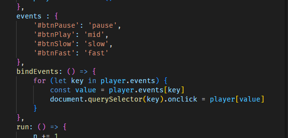

现在的 value 是方法名字符串（pause、mid、slow 等）

通过字符串拿到对应的方法

用 value 作为 key 去取它对应的方法（player.Pause等）

### 12. 代码规范

`for` 遍历 `events` 时有可能遍历到它继承的属性

`player.events` 是个对象，那么它就有 `toString` 等从**原型链**继承方法

但是浏览器默认会只遍历写好的四个方法

**但是**，如果有人，写了`Object.prototype.x = 1`

就会得到一个并不是期待中的x

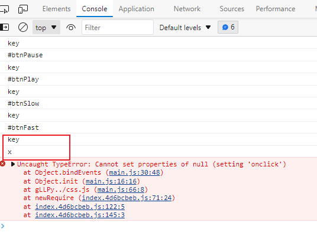

优化

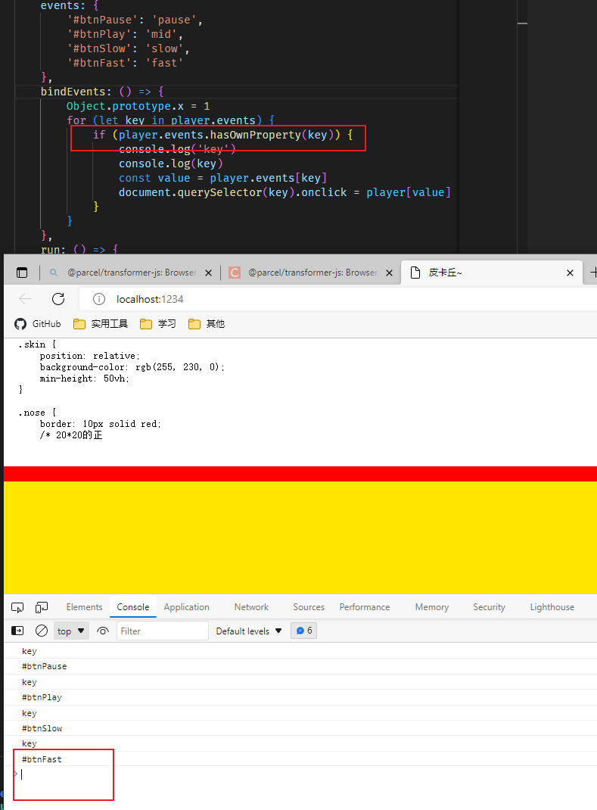

加一句就没有啦

这叫**防御性编程**

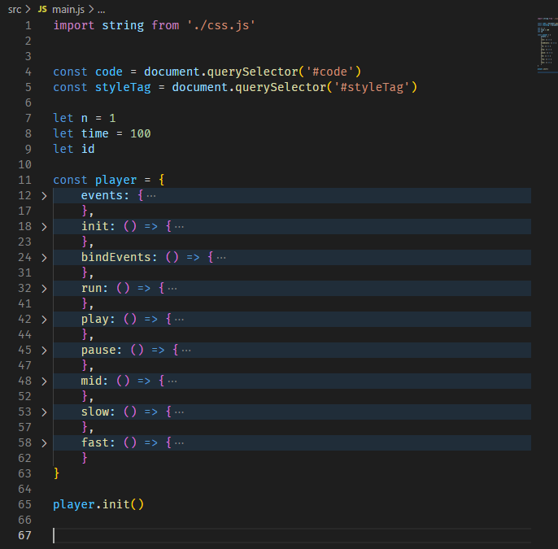

整整齐齐


>  其实还可以优化
>
> 上面的五个声明也可以放进去
>
> ```js
> const player = {
>     id: undefined,
>     time: 100,
>     n: 1，
>     ui:{
>         code: document.querySelector('#code')
>         styleTag: document.querySelector('#styleTag')
>     }
> }
> ```
>
> 这样子的话，用到的地方就都要加`player.`
>
> 所以，不改了


# 四、部署

只需要 `src文件` 和 `dist文件夹`，其他都加到 `.gitignore`

`rm -rf dist` 清空dist文件夹

`parcel build src/index.html --no-optimize --public-url ./`


`git push`

[皮卡丘~ (gretahu10.github.io)](https://gretahu10.github.io/pikachu/dist/index.html)