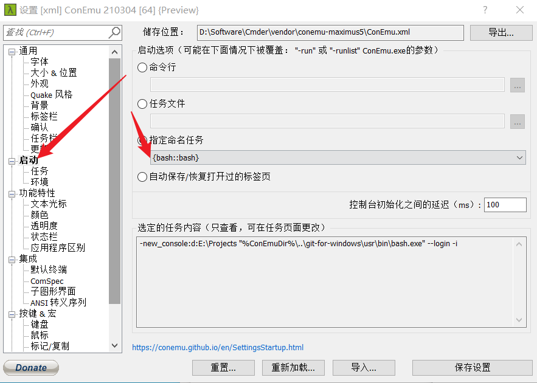

# 装机

## 一、系统

> 装系统的本质就是运行提前在U盘内放好的Windows安装包
> U盘的三种格式化方式：FAT32 （单个分区不能超过32G，单个文件不能超过4G）     exFAT       NTFS（此两种老旧主板和老旧电脑无法识别）
> 需要一个容量至少为8G的U盘（劣质U盘数据完整性较差）


### 制作启动U盘的两种方式：

1. 微软官网镜像写入
2. PE便携式操作系统辅助安装写入


### 安装步骤：

1. 1）点击<a class="button-flat button-main x-hidden-focus" id="windows10-downloadtool-now" href="https://go.microsoft.com/fwlink/?LinkId=691209" role="button">Windows 10下载</a>

   搜索微软官方下载win10，注意查看Microsoft.com官方域名


   下载好后点击运行

   * 直接安装可升级win10，也可装到U盘重装系统
   * 
      

   

   

   

   

   

2） win10安装包放在了U盘里，需要注意的点是几个文件必须要散着放在U盘的根目录里，如果觉得混乱可以在装完系统之后再拖到一个文件夹里，下一次装系统再把它们都拖出来。接下来就是利用制作好的U盘开始安装系统了。


3）开机需要修改默认启动项，进入BIOS模式（不同主板对应不同的快捷键，具体可以在主板官网搜索），【我的机器是F2】，进入BOOT（启动）项，启动共有三个选项：①电脑磁盘；②UEFI  U盘名；③U盘名。

> **介绍一下两种U盘启动方式**
>
> 开机引导方式分为Legacy和UEFI，存储数据分为MBR和GPT，Legacy引导MBR，UEFI引导GPT


   * 安装时可能会报错，“Windows无法安装到这个磁盘。选中的磁盘具有MBR分区表。在EFI系统上，Windows只能安装到GPT磁盘。“这个报错就是引导和磁盘模式造成的。

     

     解决方法：

     1） 修改开机引导选项
     
     2） Shift+f10打开命令提示符，输入`diskpart`=>回车=>`list disk`(显示电脑中的所有磁盘)=>`select disk 0`（0表示要安装的磁盘数字，如果要安装到别的磁盘，就把0换成磁盘对应的数字）=>`clean`清空磁盘=>`convert gpt`磁盘切换为GPT格式，gpt换成mbr就可以修改为MBR格式=>`exit`退出


2. 微PE

   是把一个微型的操作系统装到u盘里，制作启动盘时会直接将将U盘分成两个存储区域（类似于电脑的c盘和D盘），一个操作系统，一个可当普通u盘日常使用。

   把要安装的系统及其他工具下载到普通盘，通过U盘启动后，直接进入微PE，然后可直接进行文件的查找等操作，可用自带的分区精灵（可直接修改磁盘格式）分区后选择系统进行装载。
   
   

两种装系统的方式个人比较倾向于微PE，可操作性较强。

> Windows在安装好后，会自动补齐一些必备的驱动，大概30G左右，所以分区时，系统盘一般要预留60到100G的空间，同时系统会自动分出不属于个人意愿的容量很小的两三个分区，有MSR分区等，是对应不同的开机引导方式引导系统启动，是系统安装必须要保留的分区。

可参考B站up主硬件茶谈的教程，保姆级教程


## 二、Windows设置

1. 让自己的页面尽可能的简洁，把没用的东西都干掉
2. 一些使用技巧  
   * 用户目录：C/用户/administrator
   * 一些目录如下载、文档、图片等可移动到D盘、E盘
   * 显示文件后缀以及隐藏文件
   
3. 一些快捷键
   * win+D        展示桌面
   * win+方向键   移动窗口
   * alt+tab      切换窗口
   * alt+shift+tab 回切
   * win+tab 切换窗口，可新建桌面
   * win+ctrl+方向键 切换桌面
   * ctrl+A、ctrl+C、ctrl+V、ctrl+Z、ctrl+Y、ctrl+R、ctrl+P（打印时注意更多设置） 


### 网络

1. shadowsocks  

   [shadowsocks](https://portal.shadowsocks.nz/ )

2. 浏览器插件：Proxy SwitchyOmega（谷歌商城下载，可安装到Edge）

3. 安装proxifier

教程在小飞机网站都有


## 三、软件

### 1. 浏览器

之前用Chrom，现在Edge挺好用

插件：Proxy SwitchyOmega代理

Death To _blank   当前页面打开新标签页  

Clip to Evernote 印象笔记

### 2. VS Code 

1. 官网下载安装
2. 插件 扩展
    * Chinese   汉化 
    * Code Spell Checker    代码检查 （一些必须出错的单词可上传到用户词典或当前词典）
    * Git easy
    * Markdown All in One
    * Prettier      格式化
3. 设置 文件→首选项→设置（Ctrl+，）
    * 字体
    * 自动保存：auto sava →on FocusChange
4. 功能
    * 终端
    * 搜索
    * 设置语法 （右下角）
    * Git操作
    * 调试JS/TS
5. 快捷键
    * Ctrl+P 找文件
    * Ctrl+N 新建文件
    * Ctrl+F 搜索内容
    * Ctrl+H 替换
    * Ctrl+Shift+P 输命令 （emmet 快捷输入 emmet wrap 包围 settings 设置 wrap自动换行）
    * tab 快捷输入，补充代码单词
    * Alt+点击 多位置输入
    * ctrl+x 清空
    
### 3. Cmder
1. 安装<br/>
    官网下载好压缩文件，右键，属性，解除锁定，然后解压缩，整个文件夹移动到要安装的目录下就可以了
2. 设置
    * 汉化 Chinese 改不了的话导出配置文件进行更改  
    * 长度宽度数字、百分数不生效时使用px单位
    * 默认启动bash：设置→启动→更改为bash{bash::bash}
    * 设置快捷键（自己设置的）在设置按键中进行设置<br/>
    
* 自带一些命令<br/>
    ` git --version`<br/>
    ` which curl`


配置gitbash   

通用→中文，启动任务{bash::bash},最小化回复热键Alt+`,五个全部勾选




设置bash启动目录


右键集成菜单设置，填写完之后点击注册


快捷键设置


修改命令提示符安装目录下\Cmder\vendor\git-for-windows\etc\profile.d\git-prompt.sh


### 4.Node.js
1. 安装Node.js
   
   * Nodejs.org官网下载
   
* 安装路径需更改，node.js不允许路径中有空格 D:\Software\nodejs 
  
   * 运行`node --version`查看版本信息，判断是否安装成功
   
   * `npm --version`
   
   * `npx --version`
   
     安装之后就有了node、npm、npx命令
   
2. 安装nrm

   * `npm i -g nrm`

   * `nrm --version`

3. 配置淘宝源（node.js服务器在国外，所以需要配置）

    * `nrm ls`可使用列表

    * `nrm use taobao`使用淘宝源
    * `npm i -g http-server`安装http-server
    * `http-server --version`
    * `which http-server`运行http-server

4. 安装yarn（用来代替npm）

    * 官网yarnkpg.com 更换安装目录（下载安装yarn1.0,2.0目前还不流行，不推荐使用npm安装yarn）安装完成后需重启命令行

    * 运行`yarn --version`
    * ``yarn config list`yarn信息
    * `yarn config get registry`获取yarn运行地址registry
    * `yarn global add yrm` 安装yrm（yarn源管理器）
    * `yrm ls`
    * `yrm use taobao`


#### VS Code配合Cmder使用

1. 打开VS Code ，开启一个终端，ctrl+shift+P，输入settings，打开设置json，会有一个文件。然后根据cmder帮助文档进行设置。[cmder wiki](https://github.com/cmderdev/cmder/wiki/Seamless-VS-Code-Integration#use-cmder-embedded-git-in-vscode)

2. 

   ```json
     "git.enabled": true,
     "git.path": "D:\\Software\\cmder\\vendor\\git-for-windows\\cmd\\git.exe",
     "terminal.integrated.profiles.windows": {
       "bash": {
            "path": "D:\\Software\\cmder\\vendor\\git-for-windows\\bin\\bash.exe",
            "args": []
        }
     },
     "terminal.integrated.defaultProfile.windows": "bash",
   ```

   添加到json文件的中间，不是开头也不是最后，是两行代码中间

   保存重启终端后应用

3. 注意

   - 设置时打开设置json，不是UI，不是默认设置
   - 更改路径时` \`替换为` \\`因为 VSCode 是用 JS 写的，所以要用JS转义。

## 四、一些好用的软件

1. 社交：微信、TIM
2. 截图：Snipaste
3. 安全：火绒
4. 输入法：搜狗
5. 压缩：7zip
6. 本机文件搜索：Everything
7. 翻译：欧路词典
8. 编程字体：FiraCode  、JetBrainsMono
9. 


yarn global add git-open     运行git open可直接打开对应 的远程仓库

HTML验证器 yarn global add node-w3c-validator      运行node-w3c-validator -i 文件名     可以检查HTML文件的报错

yarn global add http-server

`http-server . -c-1  //不要缓存`


http-server 与parcel

`hs . -c-1  //不要缓存`Ctrl+单击打开预览，要在地址栏添加路径

`yarn global add parcel`

运行`parcel index.html`出现网址直接Ctrl+单击打开预览、

parcel 后加路径

parcel build src/index.html

有svg标签会报错，

使用：

parcel build src/index.html --no-optimize

超多文件，所以先清空

rm -rf dist

parcel build src/index.html --no-optimize

点开dist目录html文件看一下，main.js文件路径有误，没有dist

parcel build --help

parcel build src/index.html --no-optimize --public-url ./


一键build

pack.json文件已经有了

yarn init -y

添加：

 "scripts": {

​    "build": "rm -rf dist && parcel build src/index.html --no-optimize --public-url ./"

  },

直接运行yarn build就可以


全局安装目录C:\Users\Administrator\AppData\Roaming\npm\

[git配置文档](https://git-scm.com/book/zh/v2/%E9%99%84%E5%BD%95-C%3A-Git-%E5%91%BD%E4%BB%A4-%E8%AE%BE%E7%BD%AE%E4%B8%8E%E9%85%8D%E7%BD%AE)

yarn add jquery

删掉文件，再次进行yarn init -y  初始化

再次运行yarn add jquery  ，json文件会多一些信息

